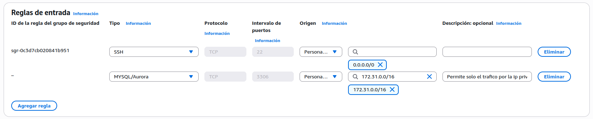
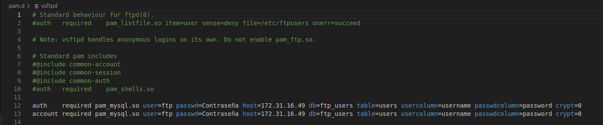
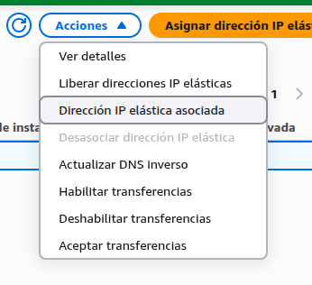

# PRACTICA FTP SRI - Diego Barboteo 2ºASIR

## Objetivo

- Tener 2 instancias EC2 AWS, una para FTP y otra para base de datos (MariaDB)

## Práctica

### 1. Crear y configurar la instáncia Ec2 para mySQL/MariaDB

- Crear la instancia con ubuntu 24.02 LTS, por defecto
- Solo permitir el trafico TCP por el puerto 3306 por la ip privada  
  

- Una vez iniciada la instancia, instalamos el paquete mariadb server, y una vez instalado, configuramos el archivo `/etc/mysql/mariadb.conf.d/50-server.cnf`, cambiando la linea `bind-address = 127.0.0.1` a `bind-address = 0.0.0.0`  
  

- A continuación, creamos la base de datos e insertamos usuario de pruebas, nos debería quedar tal que así:  
  

- Ahora creamos un usuario el cual usará FTP a posterior para obtener los datos de la tabla: `CREATE USER 'ftp'@'172.31.%.%' IDENTIFIED BY 'Contraseña';`, a este mismo usuario le vamos a garantizar todos los permisos para gestionar la base de datos que hemos creado: `GRANT ALL PRIVILEGES ON ftp_users.* TO 'ftp'@'172.31.%.%';`  

Con esto habremos configurado todo lo necesario por parte de la instancia encargada de correr la base de datos.

### 2. Crear y configurar la instáncia Ec2 para FTP

- Crear la instancia con ubuntu 24.02 LTS, por defecto
- Solo permitir el tráfico FTP a traves del puerto 21 y el rango de puertos pasivos (3000 - 3100)  
  
 
- A continuación, tendermos que instalar el servicio FTP (vsftpd) y pam (libpam-mysql) y configurarlo, para ello:  
- Cambiar el archivo `vsftpd.conf` a `vsftpd.conf.old` para reemplazarlo con nuestra configuración, en el nuevo fichero, cambiaremos el conteido  

- Cambiar el archivo de configuracion `/etc/pam.d/vsftpd`, eliminaremos o comentaremos el contenido que hay en el por defecto, y lo reemplazaremos con lo siguiente  

- Por ultimo, asignaremos una IP elástica a nuestra instancia que contiene el servicio FTP, para ello:  

- Y la asociaremos:

## Despliegue con terraform

- Cambiar los credenciales de aws en el archivo `credentials` en el directorio `~/.aws`
- Iniciar terraform en el directorio del repositorio `Terraform init`
- Construir el plan: `Terraform plan`
- Aplicar el plan: `Terraform apply`